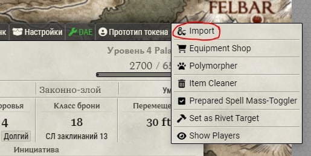
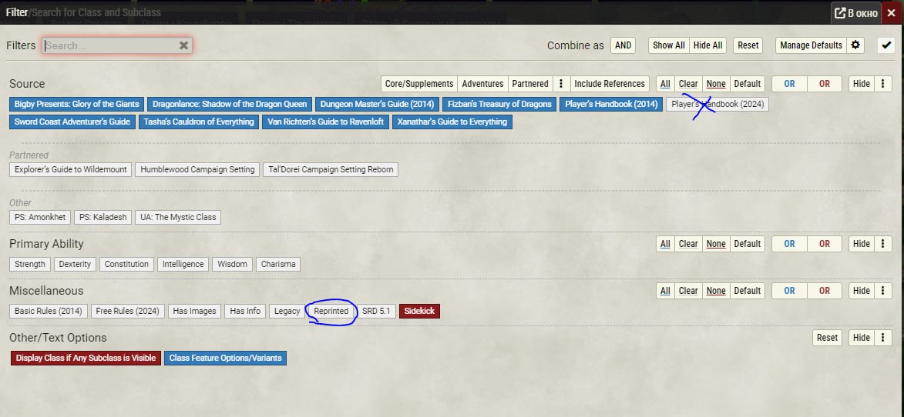

## Управление

Во время измерения расстояния / перемещения токена создание дополнительной точки кривой: Ctrl + Shift + ЛКМ
Всплывающее окно с поиском объекта: Ctrl + Space
Выбор цели: навести мышку и нажать T

Чтобы добавить персонажу свиток заклинания, нужно, воспользовавшись быстрым поиском или одним из компендиумов, найти заклинание и перетащить его на открытую вкладку "Снаряжение", тогда оно добавится как свиток, будет также при этом возможность повысить его уровень. При перетаскивании на вкладку "Заклинания" оно добавится как заклинание.

